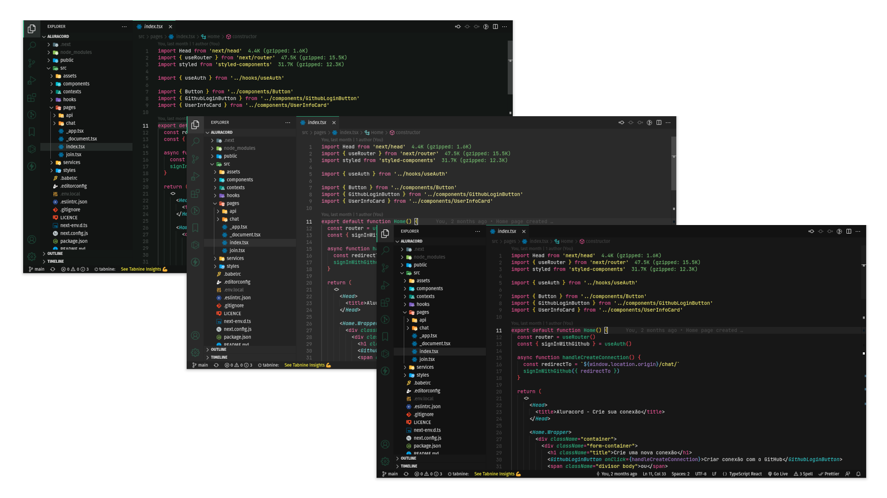

<h1 align="center">
  
   
  Bit Theme for <a href="https://code.visualstudio.com/">Visual Studio Code</a>
</h1>

  
  
  

## Install

- Go to `View -> Extensions` or press `Ctrl+Shift+X`.
- Write `Bit Theme`.
- Select it and press `Install`.
- Finally select a theme. Three theme options are available:
  - `Bit default`
  - `Bit soft`
  - `Bit intense`
